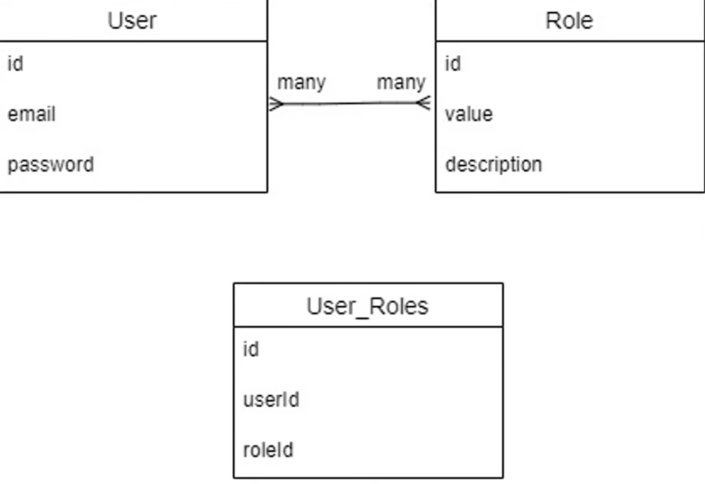

## Install nest cli 

```bash
npm i -g @nestjs/cli
```

## Running the app

```bash
# development
$ npm run start

# watch mode
$ npm run start:dev

# production mode
$ npm run start:prod
```

Create `main.ts` file and it would be a startpoint of our application. Create an instance of 
our application with `NestFactory` and start listening it: 

```typescript
import { NestFactory } from '@nestjs/core';


const start = async () => {
  const PORT = process.env.PORT || 5000;
  const app = await NestFactory.create(); // here we need to pass modules in arguments
  await app.listen(PORT, ()=>console.log(`Server is running on ${PORT}`))
}
```

Create `app.module.ts` and export class `AppModule`. NestJs bases on decorators, so we have
to mark our class with `@Module` decorator. Decorator - is a wrapper that provides to a class or a 
function new abilities.

```typescript
import { Module } from "@nestjs/common";

@Module({}) // here we will pass an config object
export class AppModule {

}
```

Return to our `main.ts` and add pass this `AppModule` to `create()` function:

```typescript
import { NestFactory } from '@nestjs/core';
import { AppModule } from "./app.module";


const start = async () => {
  const PORT = process.env.PORT || 5000;
  const app = await NestFactory.create(AppModule);
  await app.listen(PORT, ()=>console.log(`Server is running on ${PORT}`))
}

start()
```

Ok, let's move on. Create `app.controller.ts`. Mark this controller with `@Controller` decorator.
`@Controller` accepts prefix of url. Create function in this controller and to make this
function an endpoint we have to mark it with decorator and pass a url.

```typescript
import { Controller, Get } from "@nestjs/common";

@Controller('/api')
export class AppController {

  @Get('/users')
  getUsers() {
    return [{id: 1, name: 'ilichka'}]
  }
}
```

Then to make this controller work we need to register it in modules.

```typescript
import { Module } from "@nestjs/common";
import { AppController } from "./app.controller";

@Module({
  controllers: [AppController]
})
export class AppModule {

}
```

That's it! Now we can run 
### `npm run start:dev`
and move to [http://localhost:5000/api/users](http://localhost:5000/api/users) to 
receive the result of our endpoint.

Providers field in `@Module`. Providers mostly are services with reusable logic or some 
patterns implementations. Lets create our first provider `app.service.ts`. To make this class a provider
mark this class with `@Injectable` decorator. We need this services to make controller stay minimalistic.
To use our service inside controller we need to add it in provides field.

```typescript
import { Module } from "@nestjs/common";
import { AppController } from "./app.controller";
import { AppService } from "./app.service";

@Module({
  controllers: [AppController],
  providers: [AppService]
})
export class AppModule {

}
```

To use this service inside this controller we need to make `DI`. So we don't have to create
an object, nest will do it automatically.

```typescript
import { Controller, Get } from "@nestjs/common";
import { AppService } from "./app.service";

@Controller('/api')
export class AppController {

  constructor(private appService: AppService) {}

  @Get('/users')
  getUsers() {
    return this.appService.getUsers()
  }
}
```

So it's time to connect to database. We will use sequelize. 

```bash
    npm install --save pg pg-hstore
    npm install --save @nestjs/sequelize sequelize sequelize-typescript
    npm install --save-dev @types/sequelize
```

Connect database with `import` field in app module. `Import` field allows us to import
additional modules. Here we also move out env variables using `@nestjs/config`.

### `npm install @nestjs/config`

So if we need nest to read all our env config, add ConfigModule to imports.

```typescript
import { Module } from "@nestjs/common";
import { AppController } from "./app.controller";
import { AppService } from "./app.service";
import {SequelizeModule} from "@nestjs/sequelize";
import {ConfigModule} from "@nestjs/config";

@Module({
  controllers: [AppController],
  providers: [AppService],
  imports: [
      ConfigModule.forRoot({
          envFilePath: `.${process.env.NODE_ENV}.env`
      }),
    SequelizeModule.forRoot({
      dialect: 'postgres',
      host: process.env.POSTGRES_HOST,
      port: Number(process.env.POSTGRES_PORT),
      username: process.env.POSTGRES_USER,
      password: process.env.POSTGRES_PASSWORD,
      database: process.env.POSTGRES_DB,
      models: [],
      autoLoadModels: true
    }),
  ],
})
export class AppModule {

}
```

### `npm install cross-env`

Update scripts to run prod and dev version of project.

```json
{
  "start:dev": "cross-env NODE_ENV=development nest start --watch",
  "start:debug": "nest start --debug --watch",
  "start:prod": "node dist/main"
}
```

Remove `app.service.ts` and `app.controller.ts`. We will decompose our project.

To create new component of our project use nest cli:

```bash
    nest generate module users
    nest generate controller users
    nest generate service users
```

Ok, lets create model of user in `users.model.ts`. Here we're going to describe our user.

```typescript
import {Column, DataType, Model, Table} from "sequelize-typescript";

interface UserCreationAttrs {
    email: string;
    password: string;
}

@Table({tableName: 'users'})
export class User extends Model<User, UserCreationAttrs> {
    @Column({type: DataType.INTEGER, unique: true, autoIncrement: true, primaryKey: true})
    id: number;

    @Column({type: DataType.STRING, unique: true, allowNull: false})
    email: string;

    @Column({type: DataType.STRING, allowNull: false})
    password: string;

    @Column({type: DataType.BOOLEAN, defaultValue: false})
    banned: boolean;

    @Column({type: DataType.STRING, allowNull: true})
    banReason: string;
}
```

To make this class a table mark with `@Table` decorator. To make a property in class
a column mark as a `@Column`. Firs generic is a class itself, second - properties, that we
need to create an object from class. Finally, register our model in `app.module.ts`.

```typescript
 SequelizeModule.forRoot({
    // ...
    
      models: [User]
    
    // ...
    })
```

Move to `users.module.ts` and also add User model to import array. 
ForFeature ??????????????????

```typescript
@Module({
  controllers: [UsersController],
  providers: [UsersService],
  imports: [
      SequelizeModule.forFeature([User])
  ]
})
export class UsersModule {}
```

Now we have this table in pgAdmin.

Add logic to `users.service.ts`. Inject model in our service and create user-dto. Add
functions to work with users.

```typescript
import { Injectable } from '@nestjs/common';
import {User} from "./users.model";
import {InjectModel} from "@nestjs/sequelize";
import {CreateUserDto} from "./dto/create-user-dto";

@Injectable()
export class UsersService {

    constructor(@InjectModel(User) private userRepository: typeof User) {}

    async createUser(dto: CreateUserDto) {
        return await this.userRepository.create(dto)
    }

    async getAllUsers() {
        return await this.userRepository.findAll()
    }
}
```

Then create endpoint in `users.controller.ts` and inject our users service.

```typescript
import {Body, Controller, Get, Post} from '@nestjs/common';
import {CreateUserDto} from "./dto/create-user-dto";
import {UsersService} from "./users.service";

@Controller('users')
export class UsersController {

    constructor(private usersService: UsersService) {}


    @Post()
    create(@Body() userDto: CreateUserDto) {
        return this.usersService.createUser(userDto)
    }

    @Get()
    getAll() {
        return this.usersService.getAllUsers()
    }
}
```

## Documentation in swagger

### `npm install @nestjs/swagger swagger-ui-express`

Move to `main.ts` and configure swagger.

```typescript
import {DocumentBuilder, SwaggerModule} from "@nestjs/swagger";

const start = async () => {
//...
    
  const config = new DocumentBuilder()
      .setTitle('Nest app example')
      .setDescription('Swagger for our app')
      .setVersion('1.0.0')
      .addTag('ilichka')
      .build()
  const document = SwaggerModule.createDocument(app, config)
  SwaggerModule.setup('/api/docs', app, document)

    //...
}
```

Now we need to document all of our endpoints. Use `@ApiOperation` to config endpoint. 
`@ApiResponse` describes response of endpoint. To document models and dto use `@ApiProperty`. 
To group endpoint from controller use `@ApiTags`

- controller
```typescript
import {Body, Controller, Get, Post} from '@nestjs/common';
import {CreateUserDto} from "./dto/create-user-dto";
import {UsersService} from "./users.service";
import {ApiOperation, ApiResponse} from "@nestjs/swagger";
import {User} from "./users.model";

@ApiTags('Users')
@Controller('users')
export class UsersController {

    constructor(private usersService: UsersService) {}

    @ApiOperation({summary: 'Create user'})
    @ApiResponse({status: 200, type: User})
    @Post()
    create(@Body() userDto: CreateUserDto) {
        return this.usersService.createUser(userDto)
    }

    @ApiOperation({summary: 'Get users'})
    @ApiResponse({status: 200, type: [User]})
    @Get()
    getAll() {
        return this.usersService.getAllUsers()
    }
}
```

- model
```typescript
import {Column, DataType, Model, Table} from "sequelize-typescript";
import {ApiProperty} from "@nestjs/swagger";

interface UserCreationAttrs {
    email: string;
    password: string;
}

@Table({tableName: 'users'})
export class User extends Model<User, UserCreationAttrs> {
    @ApiProperty({example: '1', description: 'Unique id'})
    @Column({type: DataType.INTEGER, unique: true, autoIncrement: true, primaryKey: true})
    id: number;

    @ApiProperty({example: 'user@gmail.com', description: 'User email'})
    @Column({type: DataType.STRING, unique: true, allowNull: false})
    email: string;

    @ApiProperty({example: '12345', description: 'User password'})
    @Column({type: DataType.STRING, allowNull: false})
    password: string;

    @ApiProperty({example: 'true', description: 'Is user banned or not'})
    @Column({type: DataType.BOOLEAN, defaultValue: false})
    banned: boolean;

    @ApiProperty({example: 'Platform politic', description: 'Description of ban'})
    @Column({type: DataType.STRING, allowNull: true})
    banReason: string;
}
```

- dto 
```typescript
import {ApiProperty} from "@nestjs/swagger";

export class CreateUserDto {
    @ApiProperty({example: 'user@gmail.com', description: 'User email'})
    readonly email: string;
    @ApiProperty({example: '12345', description: 'User password'})
    readonly password: string;
}
```

## Roles and rules

```bash
    nest generate module roles
    nest generate controller roles
    nest generate service roles
```

And create model here

```typescript
import {Column, DataType, Model, Table} from "sequelize-typescript";
import {ApiProperty} from "@nestjs/swagger";

interface RoleCreationAttrs {
    value: string;
    description: string;
}

@Table({tableName: 'roles'})
export class Role extends Model<Role, RoleCreationAttrs> {
    @ApiProperty({example: '1', description: 'Unique id'})
    @Column({type: DataType.INTEGER, unique: true, autoIncrement: true, primaryKey: true})
    id: number;

    @ApiProperty({example: 'ADMIN', description: 'User role value'})
    @Column({type: DataType.STRING, unique: true, allowNull: false})
    value: string;

    @ApiProperty({example: 'Administrator', description: 'Role description'})
    @Column({type: DataType.STRING, allowNull: false})
    description: string;
}
```

Important! Cause each user can have many roles and each role can belong to many users, so
relations between two tables may-to-many. In this case we should create third table and in this
table we store, which user has witch roles. 



To create this relations use decorator `@BelongsToMany`. First arg is an entity, with
witch we connect and the second arg is a table, witch trough we connect. In `users.model.ts`

```typescript
@Table({tableName: 'users'})
export class User extends Model<User, UserCreationAttrs> {
    //...

    @BelongsToMany(()=>Role, ()=>UserRole)
    roles: Role[]
}
```

In `roles.model.ts`:

```typescript
@Table({tableName: 'roles'})
export class Role extends Model<Role, RoleCreationAttrs> {
    //...

    @BelongsToMany(()=>User, ()=>UserRole)
    user: User[]
}
```

Also we need to import both of models(`Role` and `User`) in modules.

Now we need to create this temporary table user-roles:

```typescript
import {Column, DataType, ForeignKey, Model, Table} from "sequelize-typescript";
import {Role} from "./roles.model";
import {User} from "../users/users.model";

@Table({tableName: 'roles', createdAt: false, updatedAt: false})
export class UserRoles extends Model<UserRoles> {
    @Column({type: DataType.INTEGER, unique: true, autoIncrement: true, primaryKey: true})
    id: number;

    @ForeignKey(()=>Role)
    @Column({type: DataType.INTEGER})
    roleId: number;

    @ForeignKey(()=>User)
    @Column({type: DataType.INTEGER})
    userId: number;
}
```

Use decorator `@ForeignKey` to mark a field as a foreign key. Add UserRoles to import in modules(`app`, `user`, `role`).
Then just create functions to work with roles in service and create endpoints in controller.
When we create a user we need to assign a role to him. So let's inject roleService in usersService.
In this case we need to register this service as well.
1. Export roleService
```typescript
@Module({
  controllers: [RolesController],
  providers: [RolesService],
  imports: [
    SequelizeModule.forFeature([Role, User, UserRoles])
  ],
  exports: [RolesService]
})
```
After this rolesService will export with rolesModule.

2. Import RolesModule into UsersModule
```typescript
@Module({
  controllers: [UsersController],
  providers: [UsersService],
  imports: [
      SequelizeModule.forFeature([User, Role, UserRoles]),
      RolesModule
  ]
})
```

Update createUser function:

```typescript
export class UsersService {

    constructor(@InjectModel(User) private userRepository: typeof User,
                private roleService: RolesService) {}

    async createUser(dto: CreateUserDto) {
        const user = await this.userRepository.create(dto)
        const role = await this.roleService.getRoleByValue("USER")
        await user.$set('roles',[role.id])
        return user
    }
}
```

`$set` method allows to rewrite a field and update it in database. Update methods in
`user.service.ts`

```typescript
@Injectable()
export class UsersService {

    constructor(@InjectModel(User) private userRepository: typeof User,
                private roleService: RolesService) {}

    async createUser(dto: CreateUserDto) {
        const user = await this.userRepository.create(dto)
        const role = await this.roleService.getRoleByValue("USER")
        await user.$set('roles',[role.id])
        return user
    }

    async getAllUsers() {
        return await this.userRepository.findAll({include:{all: true}})
    }
}
```

Here we added `{include: {all: true}}` to include all fields, that user connected with.

## Registration

```bash
    nest generate module auth
    nest generate controller auth
    nest generate service auth
```

Also install a module to work with jwt token and coding password.

### `npm install @nestjs/jwt bcryptjs`

Cause we use jwt to registration user, we need to register installed module `JWTModule`.

Secret token pass with `secret` field. Expires in `signOptions`

```typescript
import { Module } from '@nestjs/common';
import { AuthController } from './auth.controller';
import { AuthService } from './auth.service';
import {UsersModule} from "../users/users.module";
import {JwtModule} from "@nestjs/jwt";
import * as process from "process";

@Module({
  controllers: [AuthController],
  providers: [AuthService],
  imports: [
      UsersModule,
      JwtModule.register({
        secret: process.env.PRIVATE_KEY || 'SECRET',
          signOptions: {
            expiresIn: '24h'
          }
      })
  ]
})
export class AuthModule {}
```

Registration flow: 
1. Is any user in db with such email?
2. If yes throw error, else hash password
3. Create user
4. generate token

```typescript
@Injectable()
export class AuthService {
    constructor(private userService: UsersService,
                private jwtService: JwtService) {}

    async registration(userDto: CreateUserDto) {
        const candidate = await this.userService.getUserByEmail(userDto.email)
        if(candidate) {
            throw new HttpException('User with such email already exists', HttpStatus.BAD_REQUEST)
        }
        const hashPassword = await bcrypt.hash(userDto.password, 5)
        const user = await this.userService.createUser({...userDto, password: hashPassword})
        return this.generateToken(user)
    }

    async generateToken(user: User) {
        const payload = {email: user.email, id: user.id, roles: user.roles}
        return {
            token: this.jwtService.sign(payload)
        }
    }
}
```

Login flow: 
1. Take user from db
2. compare password

## Guards

We need guard to limit access to endpoints. For example for unauthorized users.
Create `jwt-auth.guard.ts`. Here we must implement `CanActivate`.


```typescript
import {CanActivate, ExecutionContext, UnauthorizedException} from "@nestjs/common";
import {Observable} from "rxjs";
import {JwtService} from "@nestjs/jwt";

@Injectable()
export class JwtAuthGuard implements CanActivate {

    constructor(private jwtService: JwtService) {}

    canActivate(context: ExecutionContext): boolean | Promise<boolean> | Observable<boolean> {
        const req = context.switchToHttp().getRequest()

        try {
            const authHeader = req.headers.authorization
            const [bearer, token] = authHeader.split(' ')

            if(bearer !== 'Bearer' || !token) {
                throw new UnauthorizedException({message: 'User not authed'})
            }

            const user = this.jwtService.verify(token)
            req.user = user;
            return true
        } catch (e) {
            throw new UnauthorizedException({message: 'User not authed'})
        }
    }

}
```

Let's use our guard on userService. But, during importing modules we get an error 
about circular dependencies. To prevent this use `forwardRef`.

```typescript
@Module({
  controllers: [UsersController],
  providers: [UsersService],
  imports: [
      SequelizeModule.forFeature([User, Role, UserRoles]),
      RolesModule,
      forwardRef(()=>AuthModule)
  ],
    exports: [UsersService]
})
export class UsersModule {}
```

To use guard use `@UseGuards` decorator.

```typescript
export class UsersController {
//...

    @ApiOperation({summary: 'Get users'})
    @ApiResponse({status: 200, type: [User]})
    @UseGuards(JwtAuthGuard)
    @Get()
    getAll() {
        return this.usersService.getAllUsers()
    }
}
```

We can block all endpoints as well. In `main.ts` add this row:

```typescript
  app.useGlobalGuards(JwtAuthGuard)
```

## Create decorator

```typescript
import {SetMetadata} from "@nestjs/common";

export const ROLES_KEY = 'roles'

export const Roles = (...roles: string[]) => SetMetadata(ROLES_KEY, roles)
```

We will use it ro add roles.

Now lets create roles-guard.


```typescript
import {
    CanActivate,
    ExecutionContext,
    HttpException,
    HttpStatus,
    Injectable,
    UnauthorizedException
} from "@nestjs/common";
import {Observable} from "rxjs";
import {JwtService} from "@nestjs/jwt";
import {Reflector} from "@nestjs/core";
import {ROLES_KEY} from "./roles-auth.decorator";

@Injectable()
export class RolesGuard implements CanActivate {

    constructor(private jwtService: JwtService,
                private reflector: Reflector) {}

    canActivate(context: ExecutionContext): boolean | Promise<boolean> | Observable<boolean> {
        const req = context.switchToHttp().getRequest()

        try {
            const requiredRoles = this.reflector.getAllAndOverride<string[]>(ROLES_KEY, [
                context.getHandler(),
                context.getClass()
            ])
            if(!requiredRoles) {
                return true
            }
            const authHeader = req.headers.authorization
            const [bearer, token] = authHeader.split(' ')

            if(bearer !== 'Bearer' || !token) {
                throw new UnauthorizedException({message: 'User not authed'})
            }

            const user = this.jwtService.verify(token)
            req.user = user;
            return user.roles.some(role => requiredRoles.includes(role.value))
        } catch (e) {
            throw new HttpException('User has no access', HttpStatus.FORBIDDEN)
        }
    }

}
```

## Role assignments and bans

Create 2 endpoints and 2 functions in `user.service.ts`: 

```typescript
import {HttpException, HttpStatus, Injectable} from '@nestjs/common';
import {User} from "./users.model";
import {InjectModel} from "@nestjs/sequelize";
import {CreateUserDto} from "./dto/create-user-dto";
import {RolesService} from "../roles/roles.service";
import {AddRoleDto} from "./dto/add-role.dto";
import {BanUserDto} from "./dto/ban-user.dto";

@Injectable()
export class UsersService {
//...
    
    async addRole(dto: AddRoleDto) {
        const user = await this.userRepository.findByPk(dto.userId)
        const role = await this.roleService.getRoleByValue(dto.value)

        if(role && user) {
            await user.$add('role', role.id)
            return dto
        }

        throw new HttpException('Users or role not found', HttpStatus.NOT_FOUND)
    }

    async ban(dto: BanUserDto) {
        const user = await this.userRepository.findByPk(dto.userId);
        if (!user) {
            throw new HttpException('Пользователь не найден', HttpStatus.NOT_FOUND);
        }
        user.banned = true;
        user.banReason = dto.banReason;
        await user.save();
        return user;
    }
}

```

In `addRole` we find user by PK and role by value. If both exist, with method `$add` mutate 
our roles.

In `ban` we find user again. Then reassign field ban and banReason. Call `save` method
to save changes in db

## NestJs pipes

Pipes have 2 main purposes:
- transform incoming data 
- validate incoming data

Lets create validation pipe. Here we need to install 2 tools:

### `npm install class-validator class-transformer`

Firstly validate create user dto. 

```typescript
import {ApiProperty} from "@nestjs/swagger";
import {IsEmail, IsString, Length} from "class-validator";

export class CreateUserDto {
    @ApiProperty({example: 'user@gmail.com', description: 'User email'})
    @IsString({message: 'Must be a string'})
    @IsEmail({},{message: 'Wrong email signature'})
    readonly email: string;
    @ApiProperty({example: '12345', description: 'User password'})
    @IsString({message: 'Must be a string'})
    @Length(4, 16, {message: 'Password must have length at least 4 and not more than 16'})
    readonly password: string;
}
```

We created basic validation, and now we will create some transforms in our pipe.

```typescript

```

1. Receive an object, that we would validate. Call `plainToClass` to transform our value
to class.
2. Then with `validate` method we receive an error, that will return to us after validation
of our object.

To use pipe use decorator `@UsePipe`: 

```typescript
    @ApiOperation({summary: 'Create user'})
    @ApiResponse({status: 200, type: User})
    @UsePipes(ValidationPipe)
    @Post()
    create(@Body() userDto: CreateUserDto) {
        return this.usersService.createUser(userDto)
    }
```

To add global pipes call in `main.ts` app method. They will trigger to each endpoint:

```typescript
  app.useGlobalPipes()
```

## Create posts and work with static

```bash
    nest generate module posts
    nest generate controller posts
    nest generate service posts
```

Crete `post.model.ts`. Also add relations. Cause 1 user can have a lot of posts - relations
will be 1 to many. To create this relation use decorator `@BelongsTo` and add foreign key.
We need to update `users.model.ts` as well. Add `@HasMany` decorator here. 

Move to controller and create endpoint.

```typescript
import {Body, Controller, Post, UploadedFile, UseInterceptors} from '@nestjs/common';
import {PostsService} from "./posts.service";
import {FileInterceptor} from "@nestjs/platform-express";
import {CreatePostDto} from "./dto/create-post.dto";

@Controller('posts')
export class PostsController {

    constructor(private postService: PostsService) {}

    @Post()
    @UseInterceptors(FileInterceptor('image'))
    createPost(@Body() dto: CreatePostDto,
               @UploadedFile() image) {
        return this.postService.create(dto, image)
    }
}

```

To get file in controller use decorator `@UploadedFile`. To work with file we need to add
additional decorator `@UseInterceptors` and as a parameter pass `FileInterceptor`

To work with files we have to create another service:

```bash
    nest generate module files
    nest generate service files
```

Move to file service and create function `createFile`. Import module to work with files `fs`.
Import module to work with path `path`. And to generate random file names install:

### `npm install uuid`

- Generate unique name for our file, use `uuid.v4()`.
- Use `path.resolve` to create path to file. 
- Then we check if there is nothing by this pass, so we need to create folder `mkdirSync`.
- Now folder exists and we can write file there `writeFileSync`

```typescript
import {HttpException, HttpStatus, Injectable} from '@nestjs/common';
import * as path from 'path'
import * as fs from 'fs';
import * as uuid from 'uuid';

@Injectable()
export class FilesService {

    async createFile(file): Promise<string> {
        try {
            const fileName = uuid.v4() + '.jpg';
            const filePath = path.resolve(__dirname, '..', 'static')
            if (!fs.existsSync(filePath)) {
                fs.mkdirSync(filePath, {recursive: true})
            }
            fs.writeFileSync(path.join(filePath, fileName), file.buffer)
            return fileName;
        } catch (e) {
            throw new HttpException('Error while loading file', HttpStatus.INTERNAL_SERVER_ERROR)
        }
    }

}
```

To make our server give us static install this dependency:

### `npm install --save @nestjs/serve-static`

After this in `app.module` register `ServeStaticModule`. Now your images available 
by path `localhost:5000/{file-name}`.